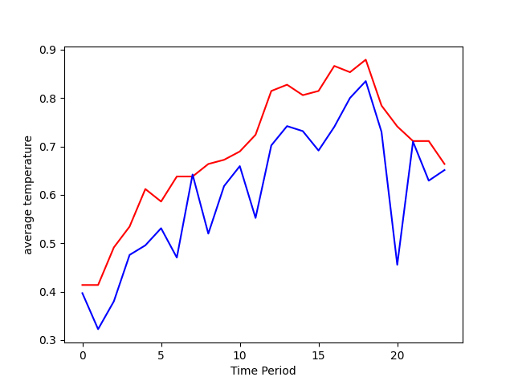
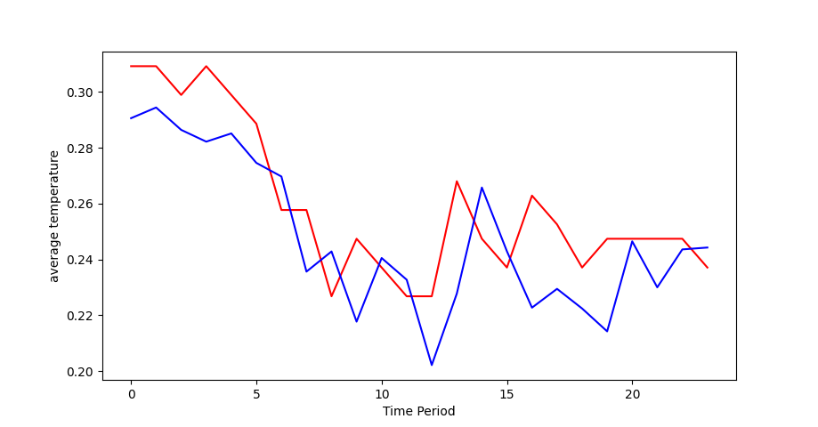

# RNN 알고리즘을 활용한 AI 농산물 가격 예측 모델 

 

## 내용 
- 농산물 가격과 날씨 데이터를 합친 데이터셋을 학습 후 미래의 농산물 가격 예측 
- 7일 단위로 학습데이터가 들어간 후 8일 째를 예측
- 원본 : https://github.com/woochan94/Tensorflow_RNN/tree/master?tab=readme-ov-file#1-3-%EB%82%A0%EC%94%A8%EC%99%80-%EB%86%8D%EC%82%B0%EB%AC%BC-%EA%B0%80%EA%B2%A9-%EB%8D%B0%EC%9D%B4%ED%84%B0-%EB%8F%99%EA%B8%B0%ED%99%94

 
 
   

 ## 2. 인공신경망 구조 
 #### 2-1. RNN 알고리즘
 #### 2-2. LSTM 알고리즘 

   

 ## 3. 결과 
> 다음 그래프들은 9년 치 데이터를 학습 후 1년간의 배추 및 무 가격을 예측한 그래프이며, X푹이 시간 Y축이 가격이며,  
> 빨간색 선이 실제 가격 데이터고 파란색 선이 예측 데이터 이다. 

**[10년 무]**

**[10년 배추]**

 
